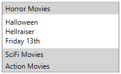

# Accordion
Namespace: **ES.Tools.Controls**



The **Accordion** is a control that contains multiple panes. Each pane is a **AccordionItem** which has a header and a content.

The 

### Accordion Properties

* *IsAnimated* - Set this to true to use a sliding animation when **AccordionItem**s are expanded or collapsed.
* *SelectionMode* - *Single* or *Multiple*. If *Single* is selected, only one **AccordionItem** is expanded at a time.

### AccordionItem Properties

* *IsSelected* - Defines if the **AccordionItem** is selected.

### Usage

In the first example, the **AccordionItem**s are added in XAML as items of the **Accordion**.

``` XML
<controls:Accordion Width="200"
                    IsAnimated="False"
                    SelectionMode="Multiple">
  <controls:AccordionItem Header="Horror Movies" IsSelected="True">
    <StackPanel>
      <TextBlock Text="Halloween"/>
      <TextBlock Text="Hellraiser"/>
      <TextBlock Text="Friday 13th"/>
    </StackPanel>
  </controls:AccordionItem>
  <controls:AccordionItem Header="SciFi Movies">
    <StackPanel>
      <TextBlock Text="2001 - A Space Odyssey"/>
      <TextBlock Text="Alien"/>
    </StackPanel>
  </controls:AccordionItem>
  <controls:AccordionItem Header="Action Movies">
    <StackPanel>
      <TextBlock Text="Rambo"/>
      <TextBlock Text="Rocky"/>
    </StackPanel>
  </controls:AccordionItem>
</controls:Accordion>
```

In the second example, the *ItemsSource* property is bound to a list of *AccordionItemViewModel*s in the *ViewModel*.  

``` XML
<controls:Accordion Width="200"
                    ItemsSource="{Binding AccordionItems}"
                    SelectionMode="Single" />
```

This is the ViewModel for each item of the accordion in the example:

``` CSharp
public class AccordionContentViewModel : ViewModel
{
  public AccordionContentViewModel(string header, object content)
  {
    Header = header;
    Content = content;
  }

  public string Header { get; }

  public object Content { get; }
}
```

In the resource dictionary, there is a *DataTemplate* defined for the *AccordionContentViewModel*:

``` XML
<DataTemplate DataType="{x:Type vm:AccordionContentViewModel}">
  <controls:AccordionItem Content="{Binding Content}" Header="{Binding Header}" />
</DataTemplate>
```
