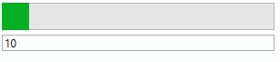

# AnimatedProgressBar
Namespace: **ES.Tools.Controls**



The **AnimatedProgressBar** control is an extended progress bar that has the ability to animate progress between two steps. It supports all features of the WPF *ProgressBar*.
Bind to the *AnimatedValue* property instead of the *Value* property to activate animations.

**Properties**

* *AnimatedValue* - Value of one step.
* *Duration* - Duration of one animation after the value has changed.
* *EasingFunction* - Easing function that is applied to the animation.

**Usage**

``` XML
<controls:AnimatedProgressBar AnimatedValue="{Binding ProgressValue}" />
```
