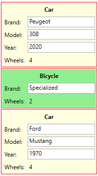

# CustomItemsControl
Namespace: **ES.Tools.Controls**

The **CustomItemsControl** control is an extended *ItemsControl* that uses a *ContentControl* for each item.
Therefore, the *ControlTemplate* can be overwritten in the *ItemContainerStyle*. This can be used for example to surround different controls with a border.

**Example**



**Usage**

In the example, we have a *ViewModel* for each item we want to show in the **CustomItemsControl**.
The visual representation of each *ViewModel* is defined by a *DataTemplate*.

```CSharp
public abstract class VehicleViewModel
{
  protected VehicleViewModel()
  { }

  public string Brand { get; set; }
  public abstract int Wheels { get; }
}

public class BicycleViewModel : VehicleViewModel
{
  public override int Wheels => 2;
}

public class CarViewModel : VehicleViewModel
{
  public string Model { get; set; }
  public int Year { get; set; }
  public override int Wheels => 4;
}
```

*DataTemplate* for the BicycleViewModel. The *DataTemplate* for the *CarViewModel* looks similar.

``` XML
<DataTemplate DataType="{x:Type vm:BicycleViewModel}">
  <Grid Background="LightGreen">
    <Grid.ColumnDefinitions>
      <ColumnDefinition Width="Auto" />
      <ColumnDefinition Width="*" />
    </Grid.ColumnDefinitions>
    <Grid.RowDefinitions>
      <RowDefinition />
      <RowDefinition />
      <RowDefinition />
    </Grid.RowDefinitions>
    <TextBlock Grid.ColumnSpan="2"
               Margin="5"
               HorizontalAlignment="Center"
               FontWeight="Bold"
               Text="Bicycle" />
    <TextBlock Grid.Row="1" Margin="5" Text="Brand:" />
    <TextBox Grid.Row="1" Grid.Column="1" Margin="2" Text="{Binding Brand}" />
    <TextBlock Grid.Row="2" Margin="5" Text="Wheels:" />
    <TextBlock Grid.Row="2" Grid.Column="1" Margin="5" Text="{Binding Wheels}" />
  </Grid>
</DataTemplate>
```

The *ViewModels* and their *DataTemplates* can already be shown in a WPF *ItemsControl*. But we want to surround each item with a red border and don't want to defne the same red border as part of the *DataTemplates*.

By using the *CustomItemsControl*, we can now define a *ControlTemplate* that does the trick.

``` XML
<controls:CustomItemsControl Grid.Row="1" ItemsSource="{Binding Items}">
  <controls:CustomItemsControl.ItemContainerStyle>
    <Style TargetType="ContentControl">
      <Setter Property="HorizontalAlignment" Value="Stretch" />
      <Setter Property="Focusable" Value="False" />
      <Setter Property="Template">
        <Setter.Value>
          <ControlTemplate>
            <Border Margin="1" Padding="1" BorderThickness="1" BorderBrush="Red">
              <ContentPresenter Content="{Binding}" />
            </Border>
          </ControlTemplate>
        </Setter.Value>
      </Setter>
    </Style>
  </controls:CustomItemsControl.ItemContainerStyle>
</controls:CustomItemsControl>
```