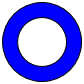

# Donut
Namespace: **ES.Tools.Controls**



The **Donut** is simple shape that is looks like a donut.

### Properties

* *DonutWidth* - Width of the circle.

### Usage

``` XML
<controls:Donut Width="80"
                ght="80"
                nutWidth="15"
                ll="Blue"
                roke="Black"
                rokeThickness="1" />
```

### Remarks

> See also [**DonutSegment**](DonutSegment.md).