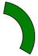

# DonutSegment
Namespace: **ES.Tools.Controls**

The **DonutSegment** is simple shape control that is rendered as a segment of a donut.

***Properties***

* *StartAngle* - Angle of the beginning of the segment (clockwise).
* *EndAngle* - Angle of the end of the segment (clockwise).
* *DonutWidth* - Width of the circle.

**Usage**

``` XML
<controls:DonutSegment Width="120"
                       Height="120"
                       StartAngle="10"
                       EndAngle="120"
                       DonutWidth="20"
                       Fill="Green"
                       Stroke="Black"
                       StrokeThickness="1" />
```
**Example**



**Remarks**

> See also [**PieSegment**](PieSegment).