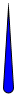

# Indicator
Namespace: **ES.Tools.Controls**

The **Indicator** is simple shape control that is rendered as an indicator.

***Properties***

No additional properties.

**Usage**

``` XML
<controls:Indicator Width="10"
                    Height="80"
                    Fill="Blue"
                    Stroke="Black"
                    StrokeThickness="1" />
```
**Example**

