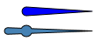

# Indicators

Namespace: **ES.Tools.Controls**



## Indicator

The **Indicator** is a shape control that renders a simple indicator pin.

### Properties

None.

### Usage

``` XML
<shapes:Indicator Width="10"
                  Height="80"
                  Fill="Blue"
                  Stroke="Black"
                  StrokeLineJoin="Round"
                  StrokeThickness="1" />
```

### Remarks

> The center of the indicator is located at a distance of Width / 2 from the bottom.

## ThinIndicator

The **ThinIndicator** is a shape control that renders a thin indicator pin with a thicker round part where the pin is mounted.

### Properties

None.

### Usage

``` XML
<shapes:ThinIndicator Width="15"
                      Height="100"
                      Margin="5"
                      Fill="SteelBlue"
                      Stroke="Black"
                      StrokeLineJoin="Round"
                      StrokeThickness="1">
```

### Remarks
> The center of the indicator is located at a distance of Height / 4 from the bottom.
