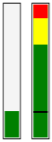

# Meter
Namespace: **ES.Tools.Controls**

The **Meter** control can be used to display values within a certain range.

**Properties**

* *Type* - One of the *MeterType* enumeration values, Bar or Column.
* *Orientation* - Horizontal or Vertical.
* *MinValue* - Minimum value to display.
* *MaxValue* - Maximum value to display.
* *Value* - Current value.

**Usage**

``` XML
<controls:Meter Width="20"
                Height="150"                
                BorderBrush="Black"
                BorderThickness="1"
                ErrorValue="90"
                MaxValue="100"
                MinValue="0"
                Type="Column"
                WarningValue="70"
                Value="{Binding Value}" />

<controls:Meter Width="20"
                Height="150"
                BorderBrush="Black"
                BorderThickness="1"
                ErrorValue="90"
                MaxValue="100"
                MinValue="0"
                Type="Bar"
                WarningValue="70"
                Value="{Binding Value}" />
```
**Example**


