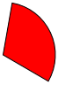

# PieSegment
Namespace: **ES.Tools.Controls**



The **PieSegment** is simple shape control that is rendered as a pie segment.

***Properties***

* *StartAngle* - Angle of the beginning of the segment (clockwise).
* *EndAngle* - Angle of the end of the segment (clockwise).

**Usage**

``` XML
<controls:PieSegment Width="120"
                     Height="120"
                     StartAngle="10"
                     EndAngle="80"
                     Fill="Red"
                     Stroke="Black"
                     StrokeThickness="1" />
```

**Remarks**

> See also [**DonutSegment**](DonutSegment).