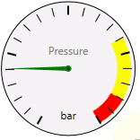
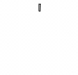
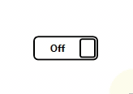

# ES.Tools
Great useful WPF controls and helpers.

## Examples
Here are some examples of controls contained in **ES.Tools**: Gauge, ProgressCircle, and Switch

## Adorners
- [**ControlAdorner**](Documentation/ControlAdorner) - Adorner that renders any control.
- [**DataTemplateAdorner**](Documentation/DataTemplateAdorner) - Adorner that will take a *DataTemplate* and a data object to render the adorner.

## Behaviors
- [**AutoScrollToCurrentItemBehavior**](Documentation/AutoScrollToCurrentItemBehavior) - Tries to bring the current item into the view. Works with any *Selector* control. 
- [**TextBoxBehavior**](Documentation/TextBoxBehavior) - Use the property *SelectAllTextOnFocus* to automatically select the whole text when the control is focused. 
- [**PasswordBoxBehavior**](Documentation/PasswordBoxBehavior) - Same as *TextBoxBehavior*, but for the WPF *PasswordBox* control.
 
## Controls
- [**AutoGrayableImage**](Documentation/AutoGrayableImage) - Image control that automatically turns itself into a grayscale image when disabled.
- [**CustomItemsControl**](Documentation/CustomItemsControl) - *ItemsControl* that uses a *ContentControl* as item container. This enables implicit *ViewModel* data templates.
- [**DonutSegment**](Documentation/DonutSegment) - Simple control that looks like a segment of a donut. 
- [**Gauge**](Documentation/Gauge) - Control that looks like a gauge with an indicator. 
- [**Indicator**](Documentation/Indicator) - Control that looks like a pin. 
- [**Meter**](Documentation/Meter) - Control that looks like a vertical or horizontal meter with or without indicator. 
- [**OfficeSlider**](Documentation/OfficeSlider) - Restyling of the WPF slider that it looks more similar to the slider in Office applications.
- [**PieSegment**](Documentation/PieSegment) - Simple control that looks like a segment of a pie.
- [**ProgressCircle**](Documentation/ProgressCircle) - A simple circular progress bar.
- [**Switch**](Documentation/Switch) - A switch button control.

## Converters
- [**BooleanToVisibilityConverter**](Documentation/Converters) - Converts a boolean value to a *System.Windows.Visibility*.
- [**ColorToStringConverter**](Documentation/Converters) - Converts a WPF *System.Windows.Media.Color* to a string and back.
- [**DateTimeToTimeSpanConverter**](Documentation/Converters) - Converts a *System.DateTime* into a *System.TimeSpan*. This can be used for data binding when the model property has to be a *System.DateTime*.
- [**TextTrimmingConverter**](Documentation/Converters) - Converts a string into a string with a limited number of characters. If the text exceeds the number of characters "..." is added.

## Effects
- [**GrayscaleEffect**](Documentation/GrayscaleEffect) - WPF *Effect* that turns the control into a monochrome colored control.

## Infrastructure
- **Services** - Singleton class that globally manages service classes.
- **TempServiceReplacer** - Utility class that replaces services temporarily.
- [**Utilities**](Documentation/Utilities) - Useful tools and extensions.

## MVVM
- [**ActionCommand**](Documentation/ActionCommand) - *ICommand* implementation, updating automatically when the *CanExecute* changes.
- [**NotifyObject**](Documentation/NotifyObject) - Basic abstract implementation of *INotifyPropertyChanged*.
- **ViewFactory** - Singleton class that manages the dependency between *ViewModel* and *View*.
- [**ViewModel**](Documentation/ViewModel) - Basic abstract implementation of a *ViewModel*. Inherits from *NotifyObject* and implements *IDisposable*.

## UI
- [**DependencyPropertyWatcher**](Documentation/DependencyPropertyWatcher) - Watches a dependency property and casts an event when the value changes.
- **DispatcherWrapper** - Wrapper that wraps a WPF dispatcher. In unit tests you can easily replace the default dispatcher by a tesing implementation.
- [**TreeHelper**](Documentation/TreeHelper) - Extension methods that help navigate the WPF visual tree and logical tree.