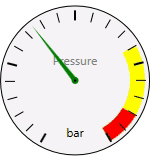
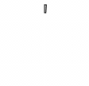
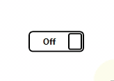

# ES.Tools

Great useful WPF controls and helpers.

## Examples

Here are some examples of controls contained in **ES.Tools**: Gauge, ProgressCircle, and Switch:

## Documentation
Take a look at the [ES.Tools Wiki](https://github.com/pschimmel/ES.Tools/wiki) for a list of all controls and tools and for the full documentation.
